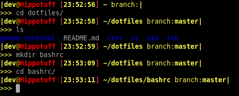

# bashrc


Just replace PS1 with this in your bashrc file
```bash
PS1='\[\e[0;1;93m\]|\[\e[0;1;93m\]\u\[\e[0;38;5;214m\]@\[\e[0;1;38;5;196m\]\h \[\e[0;91m\][\[\e[0;1;93m\]\t\[\e[0;91m\]] \[\e[0;1;93m\]\w \[\e[0;93m\]branch:\[\e[0;1;93m\]$(git branch 2>/dev/null | grep '"'"'^*'"'"' | colrm 1 2)\[\e[0;1;93m\]|\n\[\e[0;93m\]>\[\e[0;93m\]>\[\e[0;93m\]> \[\e[0m\]'
```
Just replace PS1 with this in your bashrc file for a blue color scheme
```bash
PS1='\[\e[0;1;94m\]|\[\e[0;1;94m\]\u\[\e[0;1;97m\]@\[\e[0;1;96m\]\h \[\e[0;97m\][\[\e[0;1;94m\]\t\[\e[0;97m\]] \[\e[0;1;96m\]\w \[\e[0;94m\]branch:\[\e[0;1;96m\]$(git branch 2>/dev/null | grep '"'"'^*'"'"' | colrm 1 2)\[\e[0;1;94m\]|\n\[\e[0;94m\]>\[\e[0;94m\]>\[\e[0;94m\]> \[\e[0m\]'
```

Here are my favorite features

Search in terminal on Arch Wiki and DuckDuckGo
```bash
### Search on Arch Wiki
#### Creates a custom command to open the search page on Arch Wiki directly in
#### your terminal
wiki() {
    links https://wiki.archlinux.org/index.php?search=
}
### Same as before but DuckDuckGo search
ddg() {
    links https://duckduckgo.com/?q=
}
```

### Custom IDE
```bash
#### This alias creates a tmux session with 3 panes and all moved to ~/CODE/ directory
export PROJECT_DIR='~/CODE/'
alias devenv='tmux new-session -c $(sh -c "echo $PROJECT_DIR") \; \split-window -h \; \select-pane -t 0 \; \send-keys -t 0 C-z "watch -t -n 1 ~/bin/tmuxDirUpdate.sh" Enter \; \resize-pane -L 60 \; \select-pane -t 1 \; \split-window -v \; \select-pane -t 1 \; \split-window -h \; \select-pane -t 1 \; \resize-pane -D 7 \; \select-pane -t 1 \; \resize-pane -R 14 \; \select-pane -t 1 \;'
```


~/bin/tmuxDirUpdate.sh
```bash
### This changes the pane on the left to show a current list of items
### in current directory with total directory size and per file/folder
### size listed as well.
ls -a -s -h -w 1 --color=auto $(sh -c 'tmux display-message -p -F "#{pane_current_path}" -t1')  &

### This section if commented out prevents from pane to the right of
### the main IDE window from changing its directory automatically
### if you want to enable it just remove the comments
### same goes if you want to turn off this feaature for pane below

### pane to the right of the main pane
#if [ $(sh -c 'tmux display-message -p -F "#{pane_current_path}" -t2') != $(sh -c 'tmux display-message -p -F "#{pane_current_path}" -t1') ]
#then
    #tmux send-keys -t 2 C-z "cd $(sh -c 'tmux display-message -p -F "#{pane_current_path}" -t1')" Enter
#fi

### pane below the main pane
if [ $(sh -c 'tmux display-message -p -F "#{pane_current_path}" -t3') != $(sh -c 'tmux display-message -p -F "#{pane_current_path}" -t1') ]
then
    tmux send-keys -t 3 C-z "cd $(sh -c 'tmux display-message -p -F "#{pane_current_path}" -t1')" Enter
fi
```
